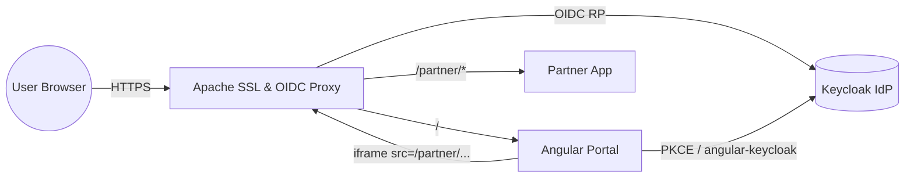
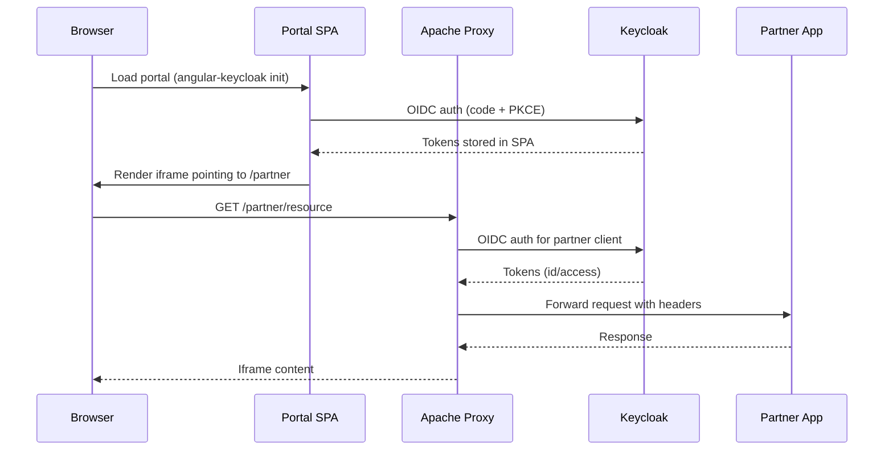

# oidc-ssl-iframe-integration

Secure, standards-compliant iframe integration using Apache as an SSL
terminator and OAuth2/OIDC enforcement point.

## Overview

This project explores how a customer-facing "portal" can expose a third-party
"partner" application inside an iframe while keeping every hop protected by
Keycloak-issued tokens. The stack runs entirely via containers so the same
topology can be reproduced locally and in CI. Angular (via `angular-keycloak`)
authenticates the initial end user, while Apache enforces OIDC for the proxied
partner routes and handles SSL termination.

## Containerized Architecture

- **Keycloak** – identity provider, realms/clients for both the portal SPA and
  the partner site, stores demo users/roles.

- **Apache Gateway** – terminates TLS, serves static callbacks (e.g.,
  `oidc_popup_callback.html`), proxies `/` → portal and `/partner/*` → partner
  app, enforces OAuth2 for partner traffic via `mod_auth_openidc`.

- **Portal (SPA)** – Angular-based UI, registered as an OIDC public client;
  loads the partner iframe and exchanges user state with Apache through HTTPS
  calls.

- **Partner App/Site** – Flask-based upstream service framed inside the portal;
  trusts Apache for authentication and authorization decisions.

### Topology Diagram

## Request & Authentication Flow

1. User hits `https://portal.localhost/` and Angular bootstraps with `angular-
   keycloak`, performing an authorization code + PKCE flow directly against
   Keycloak.

2. The authenticated UI renders an iframe whose `src` resides under
   `/partner/*`; Apache intercepts that path, triggers `mod_auth_openidc`, and
   redirects the browser to Keycloak for a second OAuth2 code flow tied to the
   partner client.

3. After Keycloak redirects back to Apache (via `/oidc_popup_callback.html` for
   silent refresh/popups), Apache validates the token set and injects
   headers/cookies before proxying the request to the partner container over
   the internal network.

4. Subsequent iframe interactions reuse the established Apache session until
   expiration, and both portal calls and partner calls remain TLS-protected
   end-to-end.

### Sequence Diagram

## Keycloak Clients

- **Portal Client** – public client with redirect URIs for the SPA, uses
  `angular-keycloak` for silent refresh. Stores user session info and drives
  the UI.

- **Partner Client** – confidential client for Apache, uses `mod_auth_openidc`
  client credentials, and has the callback set to `/oidc_popup_callback.html`
  (served statically by Apache).

## Apache Responsibilities

- Provide HTTPS certificates (self-signed for dev) and terminate TLS for all
  inbound requests.

- Proxy `/` to the portal container and `/partner/*` to the partner container
  with sticky sessions disabled to encourage idempotency.

- Serve `oidc_popup_callback.html` and related assets from a static directory.

- Enforce OAuth2 on partner paths, injecting user info headers (e.g., `X-User-
  Email`) before forwarding downstream.

## Configuration Artifacts

- `infra/keycloak/realm-export.json.template` – realm definition for the
  `portal-spa` and `partner-proxy` clients plus demo users/roles; rendered by
  the custom entrypoint before startup.

- `infra/keycloak/keycloak.conf` – Keycloak Quarkus HTTPS/hostname config
  copied into the custom image built from `infra/keycloak/Dockerfile`.

- `infra/portal/app/src/assets/keycloak.json` – Angular `KeycloakConfig`
  payload consumed by `keycloak-angular` during bootstrap.

- `infra/apache/sites/portal.conf.template` – env-templated Apache vhost baked
  into the image and rendered at runtime by `entrypoint.sh`.

- `infra/apache/html/oidc_popup_callback.html` – popup callback served by
  Apache for the partner OAuth2 flow.

- `infra/certs/README.md` – instructions to mint the shared dev certificate
  authority and per-service certs (ignored by git).

- `infra/partner/app` – Flask backend exposed through Apache; surfaces
  forwarded identity headers via `GET /claims`.

## Running with Docker Compose

1. Run `./scripts/bootstrap.sh` (requires `openssl` + `keytool`). It provisions
   the `.env` file, generates the CA + service certificates inside
   `infra/certs/`, and builds the Keycloak truststore used during startup.

2. Optionally tweak `.env` if you need different admin credentials or proxy
   secrets.

3. Import `infra/certs/portal-dev-ca.crt` into your OS/browser trust store (or
   accept the warning). The `.localhost` suffix resolves to `127.0.0.1`
   automatically on modern systems, so no manual hosts entries are required.

4. Launch the stack: `docker compose up --build`. Keycloak becomes available at
   `https://keycloak.localhost:8443`, while Apache listens on
   `https://portal.localhost` and proxies traffic to the portal + partner
   containers. Visit `https://portal.localhost` to view the Angular portal stub
   and `https://portal.localhost/partner/claims` to hit the partner API behind
   the OIDC-protected route.

> **Note:** Changes to `infra/apache/sites/portal.conf.template` or any file
> under `infra/keycloak/` now require `docker compose build apache keycloak`
> (or `docker compose up --build`) because those assets are bundled into their
> respective images.

The compose file lives at the repository root and wires the following services:

- `keycloak` (builds from `infra/keycloak/Dockerfile`, renders `realm-
  export.json` from the template, and imports it automatically on startup)

- `portal` (Angular app built from `infra/portal/app`, served via Nginx,
  bootstrapping Keycloak on load)

- `partner` (Flask backend listening on port 8080, echoing identity headers)

- `apache-gateway` (builds from `infra/apache`, loads the TLS material from
  `infra/certs`, and enforces OIDC for `/partner/*`).

## Smoke Tests

After the stack is up (and the CA is trusted locally), run
`./scripts/smoke.sh`. The script hits `https://portal.localhost/` expecting an
HTTP 200 from the Angular frontend and then calls
`https://portal.localhost/partner/`, asserting that Apache returns a 302
redirect to Keycloak. Set `VERIFY_TLS=true` to enforce certificate validation
or override the host with `BASE_URL`.

## Partner Backend

The partner container runs a lightweight Flask service (see
`infra/partner/app`) that:

- renders an informational landing page describing which headers Apache
  injects;

- exposes `GET /claims`, which echoes the received identity headers for easy
  debugging;

- provides `/healthz` for smoke tests.

This keeps the iframe target realistic enough to validate the OIDC enforcement
layer while remaining easy to extend with more routes.

## Portal Frontend

The portal service is an Angular application (`infra/portal/app`) that
leverages `keycloak-angular` to enforce an immediate login (`onLoad: 'login-
required'`). After bootstrap it fetches the user profile, renders ID-token
claims, and embeds the `/partner/` iframe so contributors can validate cross-
origin behavior without wiring a full production UI yet. The Docker image
performs a multi-stage build (Node → Nginx) so no Node runtime ships in
production containers.

## Next Steps

- Integrate the smoke script into CI so every change validates TLS routing and
  Keycloak imports automatically.

- Add end-to-end tests (e.g., Cypress) that perform a full login, load the
  iframe, and assert headers reach the partner backend.
