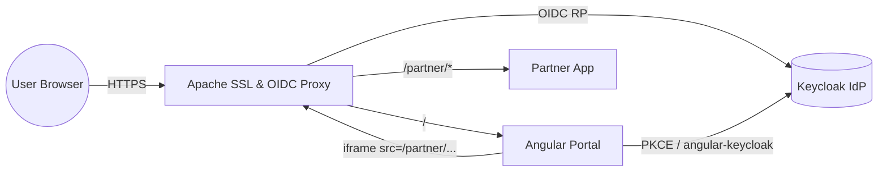
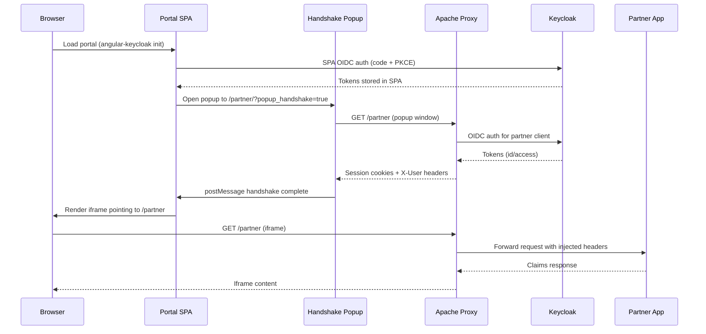

# oidc-ssl-iframe-integration

Secure, standards-compliant iframe integration using Apache as an SSL
terminator and OAuth2/OIDC enforcement point.

## Overview

This project explores how a customer-facing "portal" can expose a third-party
"partner" application inside an iframe while keeping every hop protected by
Keycloak-issued tokens. The stack runs entirely via containers so the same
topology can be reproduced locally and in CI. Angular (via `angular-keycloak`)
authenticates the initial end user and automatically launches the partner popup
handshake, while Apache enforces OIDC for the proxied partner routes and
handles SSL termination plus identity header injection.

## Containerized Architecture

- **Keycloak** – identity provider, realms/clients for both the portal SPA and
  the partner site, stores demo users/roles.

- **Apache Gateway** – terminates TLS, serves static callbacks (e.g.,
  `oidc_popup_callback.html`), proxies `/` → portal and `/partner/*` → partner
  app, enforces OAuth2 for partner traffic via `mod_auth_openidc`.

- **Portal (SPA)** – Angular-based UI, registered as an OIDC public client;
  loads the partner iframe and exchanges user state with Apache through HTTPS
  calls.

- **Partner App/Site** – Flask-based upstream service framed inside the portal;
  trusts Apache for authentication and authorization decisions.

### Topology Diagram



## Request & Authentication Flow

1. User hits `https://portal.localhost/` and the Angular shell immediately
   redirects to Keycloak using the authorization-code + PKCE flow from
   `angular-keycloak`.

2. After Keycloak sends the user back to the portal the SPA auto-launches a
   small popup pointed at `/partner/?popup_handshake=true`. That window is the
   only place where the partner client ever performs an OAuth flow.

3. Apache intercepts the popup request, performs `mod_auth_openidc` auth
   against Keycloak on behalf of the confidential `partner-proxy` client, then
   posts the resulting session back to the opener window before closing.

4. With the Apache session established the main page loads the iframe pointed
   at `/partner/`. Apache now proxies traffic to the Flask backend while
   injecting `X-User-*` headers (username, email, roles) that were minted by
   Keycloak. Subsequent iframe traffic reuses that session until it expires.

### Sequence Diagram



## Keycloak Clients

- **Portal Client** – public client with redirect URIs for the SPA, uses
  `angular-keycloak` for silent refresh. Stores user session info and drives
  the UI.

- **Partner Client** – confidential client for Apache, uses `mod_auth_openidc`
  client credentials, and has the callback set to `/oidc_popup_callback.html`
  (served statically by Apache).

## Apache Responsibilities

- Provide HTTPS certificates (self-signed for dev) and terminate TLS for all
  inbound requests.

- Proxy `/` to the portal container and `/partner/*` to the partner container
  with sticky sessions disabled to encourage idempotency.

- Serve `oidc_popup_callback.html` and related assets from a static directory.

- Enforce OAuth2 on partner paths, injecting user info headers (e.g., `X-User-
  Name`, `X-User-Email`, `X-User-Roles`) before forwarding downstream.

## Configuration Artifacts

- `infra/keycloak/realm-export.json.template` – realm definition for the
  `portal-spa` and `partner-proxy` clients plus demo users/roles and a
  protocol mapper that flattens realm roles into the `realm_roles` claim;
  rendered by the custom entrypoint before startup using values supplied
  through the `DEMO_USER_*` variables in `.env`.

- `infra/keycloak/keycloak.conf` – Keycloak Quarkus HTTPS/hostname config
  copied into the custom image built from `infra/keycloak/Dockerfile`.

- `infra/portal/app/src/assets/keycloak.json` – Angular `KeycloakConfig`
  payload consumed by `keycloak-angular` during bootstrap.

- `infra/apache/sites/portal.conf.template` – env-templated Apache vhost baked
  into the image and rendered at runtime by `entrypoint.sh`.

- `infra/apache/html/oidc_popup_callback.html` – popup callback served by
  Apache for the partner OAuth2 flow.

- `infra/certs/README.md` – instructions to mint the shared dev certificate
  authority and per-service certs (ignored by git).

- `infra/partner/app` – Flask backend exposed through Apache; surfaces
  forwarded identity headers (username, email, roles) via `GET /claims`.
- `tests/` – Cypress workspace containing the e2e config (`cypress.config.ts`),
  specs (`tests/e2e`), fixtures, and generated artifacts.

## Running with Docker Compose

1. Run `./scripts/bootstrap.sh` (requires `openssl` + `keytool`). It provisions
   the `.env` file, generates the CA + service certificates inside
   `infra/certs/`, and builds the Keycloak truststore used during startup.

2. Optionally tweak `.env` if you need different admin credentials, proxy
   secrets, or demo user profile/password via the `DEMO_USER_*` variables.

3. Import `infra/certs/portal-dev-ca.crt` into your OS/browser trust store (or
   accept the warning). The `.localhost` suffix resolves to `127.0.0.1`
   automatically on modern systems, so no manual hosts entries are required.

4. Launch the stack: `docker compose up --build`. Keycloak becomes available at
   `https://keycloak.localhost:8443`, while Apache listens on
   `https://portal.localhost` and proxies traffic to the portal + partner
 containers. Visit `https://portal.localhost` to view the Angular portal stub
  and `https://portal.localhost/partner/claims` to hit the partner API behind
  the OIDC-protected route.

> **Note:** Changes to `infra/apache/sites/portal.conf.template` or any file
> under `infra/keycloak/` now require `docker compose build apache keycloak`
> (or `docker compose up --build`) because those assets are bundled into their
> respective images.
> **Note:** The partner Flask app is also baked into an image. After editing
> `infra/partner/app/**` run `docker compose up --build partner apache` so the
> reverse proxy and backend pick up your changes.

The compose file lives at the repository root and wires the following services:

- `keycloak` (builds from `infra/keycloak/Dockerfile`, renders `realm-
  export.json` from the template, and imports it automatically on startup)

- `portal` (Angular app built from `infra/portal/app`, served via Nginx,
  bootstrapping Keycloak on load)

- `partner` (Flask backend listening on port 8080, echoing identity headers)

- `apache-gateway` (builds from `infra/apache`, loads the TLS material from
  `infra/certs`, and enforces OIDC for `/partner/*`).

## Testing

- **Vitest unit tests** – run `npm run test` inside `infra/portal/app` to
  execute the specs under `src/**/*.spec.ts`. Use `npm run test:watch` for TDD
  loops and `npm run lint` to keep ESLint happy before pushing.
- **Cypress e2e** – the `tests/` workspace hosts Cypress 13. Install deps with
  `npm install` there and run:

  ```bash
  CHROME_EXTRA_LAUNCH_ARGS="--no-sandbox --disable-gpu \
    --disable-dev-shm-usage --disable-setuid-sandbox" \
    npm run cy:run -- --browser chrome --headed
  ```

  Chrome is required because the portal relies on a real popup to complete the
  partner handshake; the extra flags keep Chromium happy on sandboxed hosts.
  The suite auto-loads credentials from `.env` (`DEMO_USER_USERNAME`,
  `DEMO_USER_PASSWORD`, etc.) but you can override them via
  `CYPRESS_PORTAL_USERNAME`, `CYPRESS_PORTAL_PASSWORD`, and
  `CYPRESS_PORTAL_ROLES`. `cy.origin()` drives both the SPA login and the
  partner popup, then asserts the iframe shows the expected claims and that
  Apache forwarded the `X-User-*` headers.
- **Smoke script** – `./scripts/smoke.sh` still pings the portal + partner
  endpoints for a quick readiness probe.

## Smoke Tests

After the stack is up (and the CA is trusted locally), run
`./scripts/smoke.sh`. The script hits `https://portal.localhost/` expecting an
HTTP 200 from the Angular frontend and then calls
`https://portal.localhost/partner/`, asserting that Apache returns a 302
redirect to Keycloak. Set `VERIFY_TLS=true` to enforce certificate validation
or override the host with `BASE_URL`.

## Partner Backend

The partner container runs a lightweight Flask service (see
`infra/partner/app`) that:

- renders an informational landing page describing which headers Apache
  injects (including `X-User-Roles` after the popup completes);

- exposes `GET /claims`, which echoes the received identity headers as JSON so
  Cypress and manual testers can confirm username/email/roles round trips;

- provides `/healthz` for smoke tests.

This keeps the iframe target realistic enough to validate the OIDC enforcement
layer while remaining easy to extend with more routes.

## Portal Frontend

The portal service is an Angular application (`infra/portal/app`) that
leverages `keycloak-angular` to enforce an immediate login (`onLoad: 'login-
required'`). After bootstrap it fetches the user profile, renders ID-token
claims, launches the popup handshake, and embeds the `/partner/` iframe so
contributors can validate cross-origin behavior without wiring a full
production UI yet. The Docker image performs a multi-stage build (Node →
Nginx) so no Node runtime ships in production containers.

## Next Steps

- Integrate the smoke script into CI so every change validates TLS routing,
  Keycloak imports, and popup behavior automatically.

- Extend the Cypress suite with negative tests (role revocation, expired
  sessions, partner error responses) so the iframe shim is covered beyond the
  happy path.
