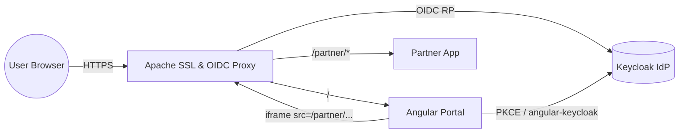
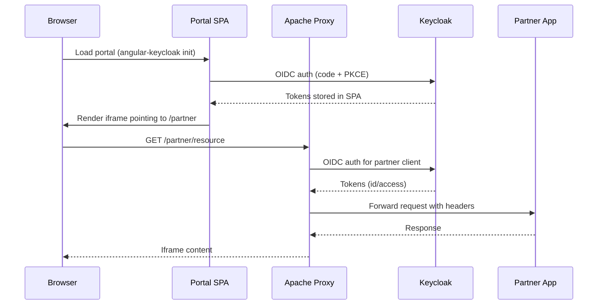

# oidc-ssl-iframe-integration

Secure, standards-compliant iframe integration using Apache as an SSL terminator and OAuth2/OIDC enforcement point.

## Overview
This project explores how a customer-facing "portal" can expose a third-party "partner" application inside an iframe while keeping every hop protected by Keycloak-issued tokens. The stack runs entirely via containers so the same topology can be reproduced locally and in CI. Angular (via `angular-keycloak`) authenticates the initial end user, while Apache enforces OIDC for the proxied partner routes and handles SSL termination.

## Containerized Architecture
- **Keycloak** – identity provider, realms/clients for both the portal SPA and the partner site, stores demo users/roles.
- **Apache Gateway** – terminates TLS, serves static callbacks (e.g., `oidc_popup_callback.html`), proxies `/` → portal and `/partner/*` → partner app, enforces OAuth2 for partner traffic via `mod_auth_openidc`.
- **Portal (SPA)** – Angular-based UI, registered as an OIDC public client; loads the partner iframe and exchanges user state with Apache through HTTPS calls.
- **Partner App/Site** – sample upstream service framed inside the portal; trusts Apache for authentication and authorization decisions.

### Topology Diagram

## Request & Authentication Flow
1. User hits `https://portal.local/` and Angular bootstraps with `angular-keycloak`, performing an authorization code + PKCE flow directly against Keycloak.
2. The authenticated UI renders an iframe whose `src` resides under `/partner/*`; Apache intercepts that path, triggers `mod_auth_openidc`, and redirects the browser to Keycloak for a second OAuth2 code flow tied to the partner client.
3. After Keycloak redirects back to Apache (via `/oidc_popup_callback.html` for silent refresh/popups), Apache validates the token set and injects headers/cookies before proxying the request to the partner container over the internal network.
4. Subsequent iframe interactions reuse the established Apache session until expiration, and both portal calls and partner calls remain TLS-protected end-to-end.

### Sequence Diagram

## Keycloak Clients
- **Portal Client** – public client with redirect URIs for the SPA, uses `angular-keycloak` for silent refresh. Stores user session info and drives the UI.
- **Partner Client** – confidential client for Apache, uses `mod_auth_openidc` client credentials, and has the callback set to `/oidc_popup_callback.html` (served statically by Apache).

## Apache Responsibilities
- Provide HTTPS certificates (self-signed for dev) and terminate TLS for all inbound requests.
- Proxy `/` to the portal container and `/partner/*` to the partner container with sticky sessions disabled to encourage idempotency.
- Serve `oidc_popup_callback.html` and related assets from a static directory.
- Enforce OAuth2 on partner paths, injecting user info headers (e.g., `X-User-Email`) before forwarding downstream.

## Configuration Artifacts
- `infra/keycloak/realm-export.json` – realm export describing the `portal-spa` and `partner-proxy` clients plus demo users/roles.
- `infra/keycloak/keycloak.conf` – Keycloak Quarkus HTTPS/hostname config pointing to mounted certificates.
- `infra/portal/keycloak.json` – Angular `KeycloakConfig` payload consumed by `angular-keycloak` during bootstrap.
- `infra/apache/conf.d/ssl.conf` & `infra/apache/conf.d/oidc.conf` – virtual host proxying logic plus `mod_auth_openidc` directives for `/partner/*`.
- `infra/apache/html/oidc_popup_callback.html` – popup callback served by Apache for the partner OAuth2 flow.
- `infra/certs/README.md` – instructions to mint the shared dev certificate authority and per-service certs (ignored by git).

## Next Steps
Implement Docker Compose definitions for each container, codify Keycloak realm exports, and document environment variables (`KEYCLOAK_URL`, `PORTAL_BASE_URL`, etc.) so contributors can launch the stack with a single command.
